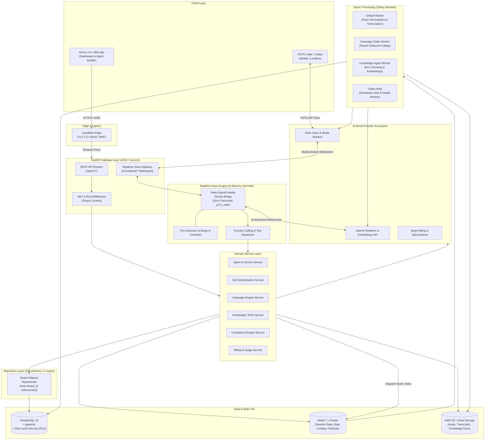
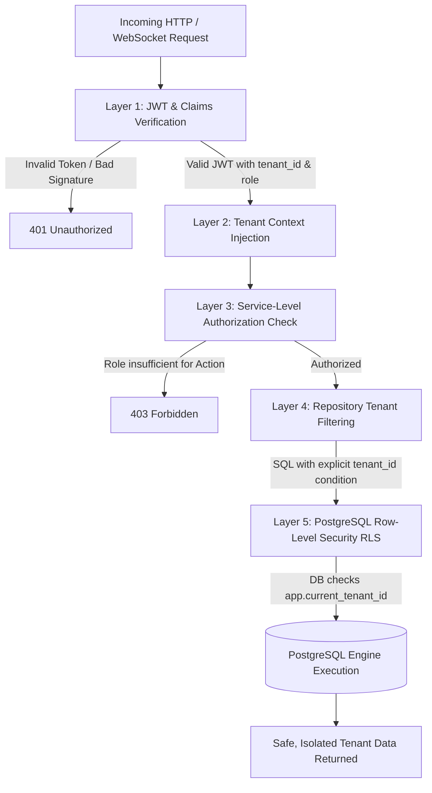
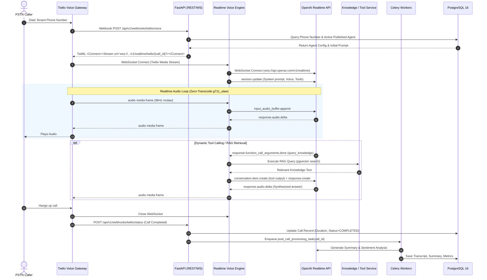
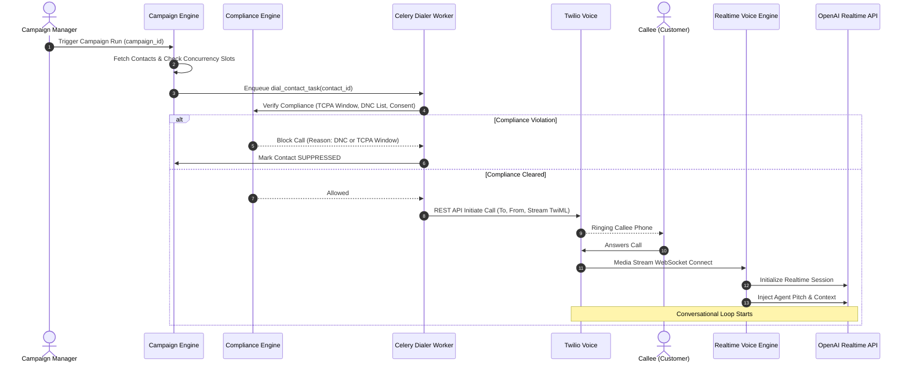
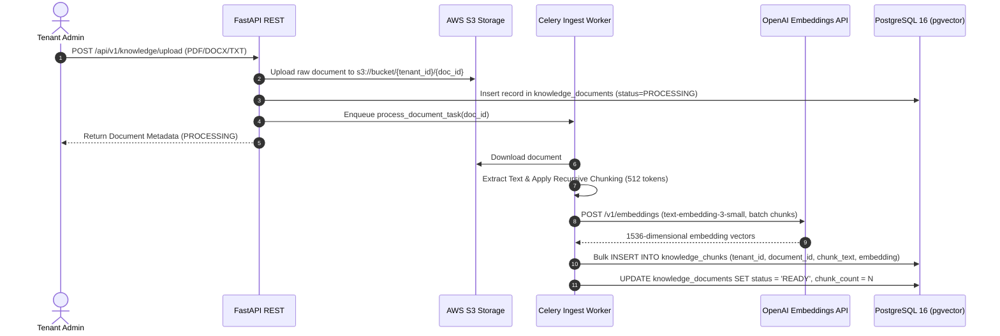

# System Architecture Documentation

**Platform:** AI Voice Calling SaaS Platform  
**Version:** Phase 1 (Foundation)  
**Status:** Approved Architecture  
**Last Updated:** 2026-09-08  

---

## 1. System Overview

The **AI Voice Calling SaaS Platform** is a multi-tenant, enterprise-grade cloud system designed to manage autonomous, low-latency, conversational voice agents for inbound customer service and outbound programmatic campaigns. 

The platform bridges enterprise telephony (Twilio) directly with next-generation multimodal streaming voice engines (OpenAI Realtime API), orchestrating contextual dialogues using tenant-scoped knowledge bases (Retrieval-Augmented Generation via `pgvector`), calendar/tool integrations, and rigorous compliance enforcement.

### 1.1 Core Mission & Performance Targets
- **Target Conversational Latency:** Sub-800ms voice-to-voice response turn-around time (Speech End → Audio Out).
- **Audio Fidelity & Efficiency:** Zero-transcode audio pipeline passing 8kHz μ-law (`g711_ulaw`) streams directly between Twilio and OpenAI without resampling overhead.
- **Tenant Isolation:** Multi-layered defense-in-depth isolation covering data storage, caching, telephony number pools, vector embeddings, and background tasks.
- **Scale Horizon:** Capable of scaling horizontally across stateless API and audio bridge instances handling thousands of concurrent calls.

---

## 2. System Architecture Diagram



---

## 3. Core Design Principles

### 3.1 Strict Multi-Tenancy
Multi-tenancy is enforced from the database layer through the API layer. Every data query, cache key, vector index lookup, and background task is scoped by a tenant identifier (`tenant_id`). The platform employs a shared-database, shared-schema model protected by PostgreSQL Row-Level Security (RLS).

### 3.2 Defense-in-Depth
Security is not entrusted to a single gatekeeper. Access control is verified at five successive boundaries:
1. **Edge/Gateway:** Strict rate limiting, IP reputation, TLS 1.3 termination, and CORS origin validation.
2. **Authentication:** Cryptographically signed JWTs (access tokens 15-minute TTL, refresh tokens 7-day TTL with rotation).
3. **Tenant Context:** Application-level context manager (`tenant_context.py`) bound to async execution frames.
4. **Repository Layer:** Abstract base repositories automatically append `WHERE tenant_id = :tenant_id` to all relational statements.
5. **PostgreSQL RLS:** Engine-level policies prevent data leakage even in the presence of application logic errors or raw SQL queries.

### 3.3 Provider Abstraction
To avoid vendor lock-in and enable isolated testing, all external services (telephony, multimodal voice, vector embeddings, cloud storage, payment processing) are abstracted behind abstract base interfaces (`ABC`). Swapping telephony providers or embedding models requires zero alterations to core business domains.

### 3.4 Event-Driven Post-Call Architecture
The real-time audio bridge path is completely decoupled from heavy persistence logic. During active voice conversations, the bridge operates purely in-memory with lightweight state tracking in Redis. Upon call termination, an event stream triggers asynchronous Celery workers to handle speech transcription synthesis, sentiment scoring, CRM webhook delivery, and billing ledger updates.

### 3.5 Zero-Transcode Audio Pipeline
Audio transcoding introduces 40ms to 120ms of processing delay per frame. The platform configures Twilio Media Streams to deliver raw 8kHz μ-law audio (`audio/x-mulaw`) and configures OpenAI Realtime API to accept and emit `g711_ulaw` format directly. Frames pass through the bridge unmodified.

### 3.6 Immutable Agent Versioning
Agents adhere to a strict finite-state lifecycle: `DRAFT` $\to$ `TESTING` $\to$ `PUBLISHED` $\to$ `ARCHIVED`. Active phone numbers and outbound campaigns can only be linked to immutable `PUBLISHED` version snapshots, guaranteeing zero configuration drift during live operational calls.

---

## 4. Component Architecture

```
e:\Aicalling\apps\api\
├── config/              # Environment settings & provider configurations
├── database.py          # SQLAlchemy 2.x async engine & session maker
├── dependencies.py      # FastAPI Depends (Auth, Tenant, Repositories)
├── models/              # SQLAlchemy ORM models (UUID PKs, TenantMixin)
├── repositories/        # Tenant-scoped data access repositories
├── schemas/             # Pydantic v2 validation & serialization schemas
├── services/            # Pure business logic & orchestration
├── providers/           # Third-party integrations (Twilio, OpenAI, Stripe)
├── routers/             # FastAPI REST endpoints & WebSocket handlers
├── workers/             # Celery task definitions & schedules
└── core/                # Security, exceptions, middleware, utilities
```

### 4.1 API Layer (FastAPI REST + WebSocket)
- **REST Endpoints:** Structured under `/api/v1/` using Pydantic v2 models for schema validation, response filtering, and automatic OpenAPI 3.1 documentation generation.
- **WebSocket Gateway:** Handles bi-directional persistent connections:
  - `/v1/realtime/twilio/{call_id}`: High-throughput media streaming for active Twilio calls.
  - `/v1/realtime/agent/test/{agent_id}`: Browser-based audio testing sandbox for agent builders.
- **Middleware Chain:**
  1. `RequestIDMiddleware`: Generates and injects a unique correlation ID (`X-Correlation-ID`) into logging contexts.
  2. `SecurityHeadersMiddleware`: Injects HSTS, CSP, X-Frame-Options, X-Content-Type-Options.
  3. `TenantContextMiddleware`: Extracts tenant claims from verified JWTs and populates async context variables.

### 4.2 Service Layer (Domain Logic)
Domain services contain pure business logic and transaction orchestration without direct knowledge of HTTP request/response objects:
- `AgentService`: Manages agent lifecycles, version cloning, prompt compilation, and tool binding.
- `CallService`: Coordinates inbound routing, outbound call dispatching, call state transitions, and post-call job dispatch.
- `CampaignService`: Manages contact lists, dialer pacing algorithms, concurrency throttling, and campaign run-states.
- `KnowledgeService`: Orchestrates document ingestion, chunking strategies, vector embeddings, and similarity retrieval.
- `ComplianceService`: Evaluates calling hour restrictions (TCPA), manages DNC lists, and validates consent records.
- `BillingService`: Tracks real-time minute balances, enforces credit limits, and syncs meter events to Stripe.

### 4.3 Repository Layer (Tenant-Filtered Data Access)
The repository layer decouples business services from database operations.
- `BaseRepository[ModelType]`: Provides typed asynchronous CRUD primitives using SQLAlchemy 2.0 select/update/delete constructs.
- `_apply_tenant_filter()`: Automatically inspects the target model class. If `tenant_id` exists on the entity, the query is injected with `WHERE model.tenant_id = :tenant_id`.
- Repositories accept an `AsyncSession` injected via FastAPI dependencies and execute exclusively inside managed transactions.

### 4.4 Provider Layer (External Service Abstractions)
All external communications implement strict abstract base classes (`ABC`):
- `TelephonyProvider`:
  - `initiate_outbound_call(to_number, from_number, stream_url)`
  - `terminate_call(call_sid)`
  - `generate_twiml_media_stream(stream_url, custom_parameters)`
  - `validate_webhook_signature(url, headers, body)`
- `RealtimeVoiceProvider`:
  - `connect_session(model, voice, instructions, tools)`
  - `stream_audio_chunk(chunk_bytes)`
  - `send_function_output(call_id, output_json)`
  - `interrupt_playback()`
- `EmbeddingProvider`:
  - `generate_embedding(text: str) -> list[float]`
  - `generate_batch_embeddings(texts: list[str]) -> list[list[float]]`
- `StorageProvider`:
  - `upload_object(key, data, content_type)`
  - `generate_presigned_url(key, expires_in)`
  - `delete_object(key)`
- `PaymentProvider`:
  - `create_customer(tenant_id, email)`
  - `create_subscription(customer_id, price_id)`
  - `record_usage(subscription_item_id, quantity)`

### 4.5 Realtime Voice Engine (Twilio ↔ OpenAI Bridge)
The voice engine orchestrates bi-directional audio between Twilio Media Streams and OpenAI Realtime WebSocket API:
1. **Twilio Handshake:** Twilio initiates connection with a `connected` and `start` event containing metadata (`callSid`, `streamSid`, custom parameters).
2. **OpenAI Session Initialization:** The bridge establishes a WebSocket connection to `wss://api.openai.com/v1/realtime`, sending `session.update` with:
   - Voice configuration (e.g., `alloy`, `echo`, `shimmer`, `ash`, `coral`).
   - Modal input/output formats: `audio/x-mulaw` (8kHz).
   - System prompt combining immutable platform safety rules, tenant agent instructions, and dynamic context.
   - Declared function calling schemas (tools).
3. **Bi-Directional Streaming:**
   - Twilio `media` payloads (base64 μ-law) are decoded and forwarded as `input_audio_buffer.append` events to OpenAI.
   - OpenAI `response.audio.delta` events (base64 μ-law) are formatted into Twilio `media` payloads and written to the Twilio WebSocket.
4. **Barge-in / Interruption Handling:**
   - OpenAI Server VAD detects caller speech and emits `input_audio_buffer.speech_started`.
   - The bridge immediately dispatches a `clear` message with `streamSid` to Twilio, flushing Twilio's audio playback buffer and arresting agent voice output in < 50ms.
5. **Tool Execution:**
   - When OpenAI returns `response.function_call_arguments.done`, the bridge executes the registered service (e.g., check calendar, query RAG, transfer call) and sends `conversation.item.create` with tool output, followed by `response.create`.

### 4.6 Knowledge Engine (RAG Pipeline with pgvector)
- **Ingestion Pipeline:**
  1. Document uploaded (`PDF`, `DOCX`, `TXT`, `Markdown`, `CSV`) $\to$ saved to S3.
  2. Background Celery task extracts clean text and extracts semantic chunks (target size: 512 tokens, 64 token overlap).
  3. Batch embeddings generated via OpenAI `text-embedding-3-small` (1536 dimensions).
  4. Chunks stored in `knowledge_chunks` table with `tenant_id` and `embedding vector(1536)`.
- **Retrieval Pipeline:**
  1. User conversational query or tool parameter converted to embedding vector.
  2. SQL similarity query executed using Cosine Distance (`<=>`):
     ```sql
     SELECT chunk_text, 1 - (embedding <=> :query_vector) AS similarity
     FROM knowledge_chunks
     WHERE tenant_id = :tenant_id
       AND document_id = :document_id
       AND 1 - (embedding <=> :query_vector) >= :threshold
     ORDER BY embedding <=> :query_vector
     LIMIT :top_k;
     ```
  3. Matched context chunks formatted into prompt blocks for conversational injection.

### 4.7 Campaign Engine (Outbound Calling)
- **Dialing Pipeline:**
  - Manages outbound contact calling at scale based on configurable campaigns.
  - Controls concurrency through Redis distributed semaphores (e.g., maximum 20 concurrent channels per tenant).
  - Pacing algorithm monitors answer rates, queue depth, and Twilio carrier rate limits (standard: 1 call per second per registered number).
- **Contact State Machine:**
  ```
  [PENDING] ──> [QUEUED] ──> [DIALING] ──> [CONNECTED] ──> [COMPLETED]
                                   ├───> [BUSY]      ──> [RETRY_SCHEDULED]
                                   ├───> [NO_ANSWER] ──> [RETRY_SCHEDULED]
                                   ├───> [FAILED]    ──> [PERMANENT_FAIL]
                                   └───> [DNC_BLOCK] ──> [SUPPRESSED]
  ```

### 4.8 Compliance Engine (Jurisdiction-Aware)
- **Pre-Dial Checks:**
  1. TCPA Permitted Window: Verifies destination local time (8:00 AM to 9:00 PM) based on recipient phone area code and timezone database.
  2. DNC Scrubbing: Matches number against platform global DNC, tenant-specific DNC, and national registry blocks.
  3. Consent Verification: Asserts active consent flag in `contact_consents`.
- **In-Call Compliance:**
  - Mandatory AI Disclosure: Enforces platform-level introductory statement ("Hello, I am an automated AI assistant calling from...") that cannot be disabled or bypassed by tenant configuration.
  - Call Recording Disclosure: Detects two-party consent states (e.g., California, Florida, Massachusetts) and automatically activates recording notification prompts.

### 4.9 Background Processing (Celery + Redis)
- **Architecture:** Celery workers backed by Redis for task message queuing and state backend.
- **Worker Queues:**
  - `priority`: Twilio post-call hangup events, real-time alert notifications.
  - `analytics`: Post-call audio transcription synthesis, LLM sentiment extraction, summary generation.
  - `campaigns`: Batch outbound dialer scheduling and contact list processing.
  - `knowledge`: Document parsing, token chunking, and embedding generation.
- **Periodic Schedules (Celery Beat):**
  - Stale session cleanup (every 10 minutes).
  - Campaign pacing evaluation (every 30 seconds).
  - Daily usage aggregation and Stripe meter synchronization (hourly).

---

## 5. Multi-Tenant Architecture & Defense-in-Depth



### 5.1 Shared Database with `tenant_id`
All tenant-scoped tables must declare:
```sql
tenant_id UUID NOT NULL REFERENCES tenants(id) ON DELETE CASCADE
```
Foreign keys enforce relational integrity. Cascading deletion guarantees that tenant offboarding cleanly purges all downstream records.

### 5.2 PostgreSQL Row-Level Security (RLS)
PostgreSQL RLS ensures that even if application-level SQL omissions occur, the database engine enforces tenant boundaries at the storage layer:
1. Every tenant-scoped table enables RLS:
   ```sql
   ALTER TABLE calls ENABLE ROW LEVEL SECURITY;
   ALTER TABLE calls FORCE ROW LEVEL SECURITY;
   ```
2. Universal tenant policy:
   ```sql
   CREATE POLICY tenant_isolation_policy ON calls
   FOR ALL
   USING (tenant_id = NULLIF(current_setting('app.current_tenant_id', true), '')::uuid);
   ```
3. Database Session Variable:
   Upon checkout of an `AsyncSession` from the connection pool, the application executes:
   ```sql
   SET LOCAL app.current_tenant_id = 'tenant-uuid-here';
   ```

---

## 6. End-to-End Data Flow Diagrams

### 6.1 Inbound Call Flow


### 6.2 Outbound Campaign Flow


### 6.3 Knowledge Ingestion Flow


---

## 7. Technology Stack

| Layer | Technology | Version | Purpose & Architecture Justification |
| :--- | :--- | :--- | :--- |
| **Backend Runtime** | Python | 3.12+ | Native high-performance asyncio support, robust typing, ecosystem maturity. |
| **API Framework** | FastAPI | 0.111+ | High throughput ASGI framework with native async endpoints and WebSocket routing. |
| **Data Validation** | Pydantic | 2.7+ | Ultra-fast Rust-based data validation and JSON serialization. |
| **ORM & Database Client** | SQLAlchemy | 2.0+ (async) | Enterprise async ORM utilizing `asyncpg` driver for non-blocking I/O. |
| **Relational Database** | PostgreSQL | 16+ | Enterprise relational ACID database supporting Row-Level Security (RLS). |
| **Vector Search** | pgvector | 0.7+ | In-database high-speed vector similarity index (IVFFlat/HNSW), avoiding standalone vector DB complexity. |
| **Database Migrations** | Alembic | 1.13+ | Version-controlled, forward-compatible schema migrations integrated with async SQLAlchemy. |
| **In-Memory Cache & Broker** | Redis | 7.2+ | Ultra-fast key-value store for session state, rate limiting, and Celery broker. |
| **Task Queue Worker** | Celery | 5.4+ | Distributed asynchronous job processing for post-call analytics and ingestion. |
| **Authentication** | PyJWT + Argon2 | Latest | Industry standard stateless token issuance and memory-hard password hashing. |
| **Telephony Gateway** | Twilio Voice | Media Streams | Global SIP/PSTN infrastructure supporting real-time bi-directional audio streaming via WebSockets. |
| **Conversational AI** | OpenAI Realtime API | `gpt-4o-realtime` | Multimodal direct voice-to-voice streaming with native function calling and server VAD. |
| **Embedding Model** | OpenAI Embeddings | `text-embedding-3-small` | High-efficiency 1536-dimensional semantic representation for knowledge retrieval. |
| **Object Storage** | AWS S3 / MinIO | S3 API | Secure, durable storage for call recordings, audio archives, and raw documentation. |
| **Billing & Payments** | Stripe API | Latest | Automated subscription management, metered usage billing, and payment processing. |

---

## 8. Key Design Decisions & Architectural Trade-offs

### 8.1 Zero-Transcode Audio Streaming (`g711_ulaw` Passthrough)
- **Context:** Traditional voice platforms convert incoming telephony audio (μ-law 8kHz) to PCM 16kHz or 24kHz for speech-to-text engines, then re-encode text-to-speech output back to μ-law 8kHz for telephony playback.
- **Problem:** Resampling and transcoding adds between 40ms and 120ms of pipeline latency per frame and consumes significant CPU resources.
- **Decision:** The platform uses OpenAI's native `g711_ulaw` format. Audio frames received from Twilio WebSocket are forwarded directly to OpenAI without decompression or resampling. Outgoing frames from OpenAI are forwarded directly back to Twilio.
- **Trade-off:** Voice models are constrained to 8kHz telephone bandwidth, which is standard for PSTN calls and yields maximal responsiveness.

### 8.2 Stateless Audio Bridge Nodes with Redis Session State
- **Context:** Active phone calls maintain long-lived WebSocket connections.
- **Decision:** Bridge instances maintain zero persistent local disk state. Ephemeral call identifiers, stream markers, and tool call progress are tracked in memory and Redis. If a bridge instance restarts, callers are gracefully routed or disconnected with immediate status webhooks without database corruption.
- **Trade-off:** Bridge servers require sticky network paths or direct DNS routing during active WebSocket lifecycles.

### 8.3 Provider Abstraction Interfaces
- **Context:** Telephony, AI models, and storage providers frequently update API contracts and pricing structures.
- **Decision:** Every external integration implements an abstract base interface (`ABC`). Business logic in `apps.api.services.*` interacts strictly with domain interfaces.
- **Trade-off:** Requires writing interface adapters, but guarantees that alternative providers (e.g., Telnyx, Deepgram, Anthropic) can be integrated without modifying business logic.

### 8.4 Event-Driven Post-Call Pipeline
- **Context:** Following a 5-minute phone call, multiple computational operations must occur: audio transcript assembly, LLM summary generation, customer sentiment tagging, webhook delivery to tenant CRM, and Stripe billing calculation.
- **Decision:** The live call bridge emits a lightweight `call.completed` event to Redis and terminates its execution. Dedicated background Celery workers consume the event and perform the compute-heavy tasks out-of-band.
- **Trade-off:** Call analytics and transcripts are available within 2-5 seconds after call termination rather than instantaneously, preserving 100% of API bandwidth for active voice bridges.

### 8.5 Immutable Agent Version Lifecycle
- **Context:** Changes made to an agent's prompt, tools, or voice settings while active calls are running can produce erratic agent behavior or crash active calls.
- **Decision:** Agents feature a version state machine:
  - `DRAFT`: Editable sandbox configuration for testing.
  - `TESTING`: Locked for testing in browser or sandbox phone lines.
  - `PUBLISHED`: Frozen, immutable configuration snapshot with a dedicated version number (e.g., `v1.2.0`). All inbound phone numbers and outbound campaigns link exclusively to a `PUBLISHED` version ID.
  - `ARCHIVED`: Deprecated historical snapshot.
- **Trade-off:** Editing a published agent requires creating a new version increment and explicitly publishing it. This guarantees bulletproof stability and auditability.
