# Database Architecture & Schema Documentation

**Platform:** AI Voice Calling SaaS Platform  
**Engine:** PostgreSQL 16 with `pgvector`  
**Version:** Phase 1 (Foundation)  
**Last Updated:** 2026-09-08  

---

## 1. Database Engine & Extension Specifications

The platform is built on **PostgreSQL 16**, leveraging its enterprise concurrency features, Row-Level Security (RLS), and vector search capabilities.

### 1.1 Required PostgreSQL Extensions
The database bootstrap script initializes three fundamental extensions:
```sql
-- Core cryptographic generation for UUIDs and secure hashes
CREATE EXTENSION IF NOT EXISTS "uuid-ossp";
CREATE EXTENSION IF NOT EXISTS "pgcrypto";

-- pgvector extension for high-dimensional semantic search
CREATE EXTENSION IF NOT EXISTS "vector";
```

- **`uuid-ossp` / `pgcrypto`:** Provides `gen_random_uuid()` for generating cryptographically secure UUIDv4 primary keys.
- **`vector` (pgvector 0.7+):** Provides native vector types (`vector(1536)`), distance operators (`<=>` cosine distance, `<->` Euclidean L2 distance, `<#>` negative inner product), and accelerated indexes (HNSW and IVFFlat).

---

## 2. Schema Design Principles

1. **UUIDv4 Primary Keys:** Every table uses a UUID primary key (`id UUID PRIMARY KEY DEFAULT gen_random_uuid()`). This prevents enumeration attacks, facilitates distributed ID generation, and eliminates auto-increment coordination bottlenecks.
2. **Mandatory Tenant Scoping:** Every tenant-scoped entity contains an indexed foreign key:
   ```sql
   tenant_id UUID NOT NULL REFERENCES tenants(id) ON DELETE CASCADE
   ```
3. **Timezone-Aware Timestamps:** All time columns use `TIMESTAMPTZ` (Timestamp with Timezone, stored internally as UTC). Raw `TIMESTAMP` without timezone is prohibited.
4. **Automated Audit Columns:** Standard mixin columns `created_at` and `updated_at` are present on every entity, with `updated_at` updated via a PostgreSQL trigger:
   ```sql
   created_at TIMESTAMPTZ NOT NULL DEFAULT CURRENT_TIMESTAMP,
   updated_at TIMESTAMPTZ NOT NULL DEFAULT CURRENT_TIMESTAMP
   ```
5. **Soft Deletion where Auditing Requires:** Sensitive operational tables (`agents`, `phone_numbers`, `contacts`, `campaigns`) include `deleted_at TIMESTAMPTZ NULL` to maintain historical relational integrity and compliance records.
6. **Extensible JSONB Structures:** Configuration blobs (agent tool parameters, voice synthesis options, webhook metadata) use PostgreSQL `JSONB` with partial GIN indexing.

---

## 3. Entity Relationship Diagram (ERD)

```mermaid
erDiagram
    tenants ||--o{ users : "has"
    tenants ||--o{ user_sessions : "tracks"
    tenants ||--o{ api_keys : "issues"
    tenants ||--o{ feature_flags : "configures"
    tenants ||--o{ agents : "owns"
    tenants ||--o{ phone_numbers : "allocates"
    tenants ||--o{ routing_groups : "defines"
    tenants ||--o{ human_agents : "employs"
    tenants ||--o{ calls : "logs"
    tenants ||--o{ contacts : "stores"
    tenants ||--o{ campaigns : "schedules"
    tenants ||--o{ knowledge_documents : "maintains"
    tenants ||--o{ appointments : "schedules"
    tenants ||--o{ integrations : "connects"
    tenants ||--o{ subscriptions : "subscribes"
    tenants ||--o{ audit_logs : "records"

    users ||--o{ user_sessions : "initiates"
    users ||--o{ api_keys : "creates"
    users ||--o{ audit_logs : "triggers"

    agents ||--o{ agent_versions : "versions"
    agents ||--o{ calls : "handles"
    agent_versions ||--o{ calls : "executes"

    routing_groups ||--o{ human_agents : "groups"
    routing_groups ||--o{ calls : "escalates"

    phone_numbers ||--o{ calls : "receives_or_dials"

    calls ||--o{ call_events : "emits"
    calls ||--o{ call_transcripts : "generates"
    calls ||--o{ usage_records : "incurs"
    calls ||--o{ appointments : "books"

    contacts ||--o{ contact_consents : "grants"
    contacts ||--o{ campaign_contacts : "targeted_in"
    contacts ||--o{ calls : "participates_in"
    contacts ||--o{ appointments : "participates_in"

    campaigns ||--o{ campaign_contacts : "contains"
    campaigns ||--o{ campaign_scripts : "utilizes"
    campaigns ||--o{ calls : "spawns"

    knowledge_documents ||--o{ knowledge_chunks : "divided_into"

    subscriptions ||--o{ usage_records : "meters"

    tenants {
        uuid id PK
        string name
        string slug UK
        string status
        timestamptz created_at
        timestamptz updated_at
    }

    users {
        uuid id PK
        uuid tenant_id FK
        string email UK
        string password_hash
        string first_name
        string last_name
        string role
        string status
        timestamptz created_at
    }

    user_sessions {
        uuid id PK
        uuid tenant_id FK
        uuid user_id FK
        string refresh_token_hash
        string ip_address
        string user_agent
        timestamptz expires_at
        timestamptz last_active_at
    }

    api_keys {
        uuid id PK
        uuid tenant_id FK
        uuid user_id FK
        string name
        string key_prefix
        string key_hash
        timestamptz expires_at
        timestamptz revoked_at
    }

    feature_flags {
        uuid id PK
        uuid tenant_id FK
        string flag_key
        boolean enabled
        jsonb metadata
    }

    agents {
        uuid id PK
        uuid tenant_id FK
        string name
        string description
        string current_version_id
        string status
        timestamptz created_at
    }

    agent_versions {
        uuid id PK
        uuid tenant_id FK
        uuid agent_id FK
        integer version_number
        string state
        text system_prompt
        string voice_provider
        string voice_id
        jsonb tools_config
        timestamptz created_at
    }

    routing_groups {
        uuid id PK
        uuid tenant_id FK
        string name
        string strategy
        integer fallback_timeout_seconds
    }

    human_agents {
        uuid id PK
        uuid tenant_id FK
        uuid routing_group_id FK
        string name
        string phone_number
        string status
    }

    phone_numbers {
        uuid id PK
        uuid tenant_id FK
        uuid assigned_agent_id FK
        string e164_number UK
        string provider
        string country_code
        string status
    }

    calls {
        uuid id PK
        uuid tenant_id FK
        uuid agent_id FK
        uuid agent_version_id FK
        uuid phone_number_id FK
        uuid contact_id FK
        string direction
        string status
        integer duration_seconds
        timestamptz started_at
        timestamptz ended_at
    }

    call_events {
        uuid id PK
        uuid tenant_id FK
        uuid call_id FK
        string event_type
        jsonb payload
        timestamptz created_at
    }

    call_transcripts {
        uuid id PK
        uuid tenant_id FK
        uuid call_id FK
        string speaker
        text message_text
        decimal sentiment_score
        timestamptz timestamp
    }

    contacts {
        uuid id PK
        uuid tenant_id FK
        string phone_e164
        string first_name
        string last_name
        string email
        string timezone
        boolean is_dnc
    }

    contact_consents {
        uuid id PK
        uuid tenant_id FK
        uuid contact_id FK
        string consent_type
        string consent_status
        string proof_source
        timestamptz recorded_at
    }

    campaigns {
        uuid id PK
        uuid tenant_id FK
        uuid agent_id FK
        string name
        string status
        integer max_concurrency
        timestamptz scheduled_start
    }

    campaign_contacts {
        uuid id PK
        uuid tenant_id FK
        uuid campaign_id FK
        uuid contact_id FK
        string status
        integer retry_count
        timestamptz last_attempted_at
    }

    campaign_scripts {
        uuid id PK
        uuid tenant_id FK
        uuid campaign_id FK
        string script_type
        text prompt_override
    }

    knowledge_documents {
        uuid id PK
        uuid tenant_id FK
        string title
        string file_type
        string s3_key
        string status
        integer chunk_count
    }

    knowledge_chunks {
        uuid id PK
        uuid tenant_id FK
        uuid document_id FK
        integer chunk_index
        text chunk_text
        vector_1536 embedding
    }

    appointments {
        uuid id PK
        uuid tenant_id FK
        uuid call_id FK
        uuid contact_id FK
        string summary
        timestamptz start_time
        timestamptz end_time
        string status
    }

    integrations {
        uuid id PK
        uuid tenant_id FK
        string provider
        string status
        jsonb encrypted_credentials
    }

    subscriptions {
        uuid id PK
        uuid tenant_id FK
        string stripe_customer_id
        string stripe_subscription_id
        string plan_tier
        string status
    }

    usage_records {
        uuid id PK
        uuid tenant_id FK
        uuid subscription_id FK
        uuid call_id FK
        string metric_type
        decimal quantity
        timestamptz recorded_at
    }

    audit_logs {
        uuid id PK
        uuid tenant_id FK
        uuid user_id FK
        string action
        string entity_type
        uuid entity_id
        jsonb changes
        string ip_address
        timestamptz created_at
    }
```



---

## 4. Core Schema Specifications & DDL

### 4.1 Tenancy & Identity Tables

#### `tenants`
Root organization account in the multi-tenant system.
```sql
CREATE TABLE tenants (
    id UUID PRIMARY KEY DEFAULT gen_random_uuid(),
    name VARCHAR(255) NOT NULL,
    slug VARCHAR(255) NOT NULL UNIQUE,
    status VARCHAR(50) NOT NULL DEFAULT 'ACTIVE', -- ACTIVE, SUSPENDED, DELETED
    billing_email VARCHAR(255) NOT NULL,
    settings JSONB NOT NULL DEFAULT '{}'::jsonb,
    created_at TIMESTAMPTZ NOT NULL DEFAULT CURRENT_TIMESTAMP,
    updated_at TIMESTAMPTZ NOT NULL DEFAULT CURRENT_TIMESTAMP,
    deleted_at TIMESTAMPTZ NULL
);
CREATE INDEX idx_tenants_slug ON tenants(slug);
CREATE INDEX idx_tenants_status ON tenants(status);
```

#### `users`
Accounts authorized to authenticate into a tenant workspace.
```sql
CREATE TABLE users (
    id UUID PRIMARY KEY DEFAULT gen_random_uuid(),
    tenant_id UUID NOT NULL REFERENCES tenants(id) ON DELETE CASCADE,
    email VARCHAR(255) NOT NULL,
    password_hash VARCHAR(255) NOT NULL,
    first_name VARCHAR(100) NOT NULL,
    last_name VARCHAR(100) NOT NULL,
    role VARCHAR(50) NOT NULL DEFAULT 'AGENT_BUILDER', 
    status VARCHAR(50) NOT NULL DEFAULT 'ACTIVE', -- ACTIVE, INVITED, SUSPENDED
    created_at TIMESTAMPTZ NOT NULL DEFAULT CURRENT_TIMESTAMP,
    updated_at TIMESTAMPTZ NOT NULL DEFAULT CURRENT_TIMESTAMP,
    deleted_at TIMESTAMPTZ NULL,
    CONSTRAINT uq_tenant_user_email UNIQUE (tenant_id, email)
);
CREATE INDEX idx_users_tenant_role ON users(tenant_id, role);
```

#### `user_sessions`
Tracks active sessions and refresh token rotation.
```sql
CREATE TABLE user_sessions (
    id UUID PRIMARY KEY DEFAULT gen_random_uuid(),
    tenant_id UUID NOT NULL REFERENCES tenants(id) ON DELETE CASCADE,
    user_id UUID NOT NULL REFERENCES users(id) ON DELETE CASCADE,
    family_id UUID NOT NULL,
    refresh_token_hash VARCHAR(255) NOT NULL UNIQUE,
    ip_address INET NOT NULL,
    user_agent TEXT NOT NULL,
    is_revoked BOOLEAN NOT NULL DEFAULT FALSE,
    expires_at TIMESTAMPTZ NOT NULL,
    last_active_at TIMESTAMPTZ NOT NULL DEFAULT CURRENT_TIMESTAMP,
    created_at TIMESTAMPTZ NOT NULL DEFAULT CURRENT_TIMESTAMP
);
CREATE INDEX idx_user_sessions_user_family ON user_sessions(user_id, family_id);
CREATE INDEX idx_user_sessions_expires ON user_sessions(expires_at);
```

#### `api_keys`
Programmatic API keys for tenant developers and automated webhooks.
```sql
CREATE TABLE api_keys (
    id UUID PRIMARY KEY DEFAULT gen_random_uuid(),
    tenant_id UUID NOT NULL REFERENCES tenants(id) ON DELETE CASCADE,
    user_id UUID NOT NULL REFERENCES users(id) ON DELETE CASCADE,
    name VARCHAR(100) NOT NULL,
    key_prefix VARCHAR(16) NOT NULL,
    key_hash VARCHAR(255) NOT NULL UNIQUE,
    scopes JSONB NOT NULL DEFAULT '["*"]'::jsonb,
    expires_at TIMESTAMPTZ NULL,
    revoked_at TIMESTAMPTZ NULL,
    created_at TIMESTAMPTZ NOT NULL DEFAULT CURRENT_TIMESTAMP
);
CREATE INDEX idx_api_keys_tenant ON api_keys(tenant_id);
CREATE INDEX idx_api_keys_hash ON api_keys(key_hash);
```

#### `feature_flags`
Tenant-level dynamic feature toggles and capacity limits.
```sql
CREATE TABLE feature_flags (
    id UUID PRIMARY KEY DEFAULT gen_random_uuid(),
    tenant_id UUID NOT NULL REFERENCES tenants(id) ON DELETE CASCADE,
    flag_key VARCHAR(100) NOT NULL,
    enabled BOOLEAN NOT NULL DEFAULT FALSE,
    metadata JSONB NOT NULL DEFAULT '{}'::jsonb,
    created_at TIMESTAMPTZ NOT NULL DEFAULT CURRENT_TIMESTAMP,
    updated_at TIMESTAMPTZ NOT NULL DEFAULT CURRENT_TIMESTAMP,
    CONSTRAINT uq_tenant_flag UNIQUE (tenant_id, flag_key)
);
```

---

### 4.2 AI Agent Domain Tables

#### `agents`
Top-level agent definition.
```sql
CREATE TABLE agents (
    id UUID PRIMARY KEY DEFAULT gen_random_uuid(),
    tenant_id UUID NOT NULL REFERENCES tenants(id) ON DELETE CASCADE,
    name VARCHAR(150) NOT NULL,
    description TEXT NULL,
    current_version_id UUID NULL,
    status VARCHAR(50) NOT NULL DEFAULT 'ACTIVE', -- ACTIVE, INACTIVE, ARCHIVED
    created_at TIMESTAMPTZ NOT NULL DEFAULT CURRENT_TIMESTAMP,
    updated_at TIMESTAMPTZ NOT NULL DEFAULT CURRENT_TIMESTAMP,
    deleted_at TIMESTAMPTZ NULL
);
CREATE INDEX idx_agents_tenant ON agents(tenant_id);
```

#### `agent_versions`
Immutable version snapshots of agent prompt, voice, and tool configurations.
```sql
CREATE TABLE agent_versions (
    id UUID PRIMARY KEY DEFAULT gen_random_uuid(),
    tenant_id UUID NOT NULL REFERENCES tenants(id) ON DELETE CASCADE,
    agent_id UUID NOT NULL REFERENCES agents(id) ON DELETE CASCADE,
    version_number INTEGER NOT NULL,
    state VARCHAR(50) NOT NULL DEFAULT 'DRAFT', -- DRAFT, TESTING, PUBLISHED, ARCHIVED
    system_prompt TEXT NOT NULL,
    voice_provider VARCHAR(50) NOT NULL DEFAULT 'openai',
    voice_id VARCHAR(100) NOT NULL DEFAULT 'alloy',
    temperature DECIMAL(3, 2) NOT NULL DEFAULT 0.70,
    tools_config JSONB NOT NULL DEFAULT '[]'::jsonb,
    knowledge_base_ids JSONB NOT NULL DEFAULT '[]'::jsonb,
    compliance_rules JSONB NOT NULL DEFAULT '{}'::jsonb,
    created_at TIMESTAMPTZ NOT NULL DEFAULT CURRENT_TIMESTAMP,
    CONSTRAINT uq_agent_version_number UNIQUE (agent_id, version_number)
);
CREATE INDEX idx_agent_versions_lookup ON agent_versions(tenant_id, agent_id, state);
```

#### `routing_groups` & `human_agents`
Defines human handoff queues and fallback telephone routing targets.
```sql
CREATE TABLE routing_groups (
    id UUID PRIMARY KEY DEFAULT gen_random_uuid(),
    tenant_id UUID NOT NULL REFERENCES tenants(id) ON DELETE CASCADE,
    name VARCHAR(100) NOT NULL,
    strategy VARCHAR(50) NOT NULL DEFAULT 'ROUND_ROBIN', -- ROUND_ROBIN, SIMULTANEOUS, ESCALATION
    fallback_timeout_seconds INTEGER NOT NULL DEFAULT 30,
    created_at TIMESTAMPTZ NOT NULL DEFAULT CURRENT_TIMESTAMP,
    updated_at TIMESTAMPTZ NOT NULL DEFAULT CURRENT_TIMESTAMP
);

CREATE TABLE human_agents (
    id UUID PRIMARY KEY DEFAULT gen_random_uuid(),
    tenant_id UUID NOT NULL REFERENCES tenants(id) ON DELETE CASCADE,
    routing_group_id UUID NOT NULL REFERENCES routing_groups(id) ON DELETE CASCADE,
    name VARCHAR(100) NOT NULL,
    phone_number VARCHAR(30) NOT NULL,
    status VARCHAR(50) NOT NULL DEFAULT 'AVAILABLE', -- AVAILABLE, BUSY, OFFLINE
    created_at TIMESTAMPTZ NOT NULL DEFAULT CURRENT_TIMESTAMP
);
```

---

### 4.3 Telephony & Voice Call Tables

#### `phone_numbers`
Inbound/outbound telephone inventory allocated to a tenant.
```sql
CREATE TABLE phone_numbers (
    id UUID PRIMARY KEY DEFAULT gen_random_uuid(),
    tenant_id UUID NOT NULL REFERENCES tenants(id) ON DELETE CASCADE,
    assigned_agent_id UUID NULL REFERENCES agents(id) ON DELETE SET NULL,
    e164_number VARCHAR(30) NOT NULL UNIQUE,
    provider VARCHAR(50) NOT NULL DEFAULT 'twilio',
    provider_sid VARCHAR(100) NOT NULL UNIQUE,
    country_code VARCHAR(10) NOT NULL DEFAULT 'US',
    capabilities JSONB NOT NULL DEFAULT '{"voice": true, "sms": false}'::jsonb,
    status VARCHAR(50) NOT NULL DEFAULT 'ACTIVE',
    created_at TIMESTAMPTZ NOT NULL DEFAULT CURRENT_TIMESTAMP,
    updated_at TIMESTAMPTZ NOT NULL DEFAULT CURRENT_TIMESTAMP,
    deleted_at TIMESTAMPTZ NULL
);
CREATE INDEX idx_phone_numbers_tenant ON phone_numbers(tenant_id);
```

#### `calls`
Core transactional call record.
```sql
CREATE TABLE calls (
    id UUID PRIMARY KEY DEFAULT gen_random_uuid(),
    tenant_id UUID NOT NULL REFERENCES tenants(id) ON DELETE CASCADE,
    agent_id UUID NULL REFERENCES agents(id) ON DELETE SET NULL,
    agent_version_id UUID NULL REFERENCES agent_versions(id) ON DELETE SET NULL,
    phone_number_id UUID NULL REFERENCES phone_numbers(id) ON DELETE SET NULL,
    contact_id UUID NULL,
    direction VARCHAR(20) NOT NULL, -- INBOUND, OUTBOUND
    from_number VARCHAR(30) NOT NULL,
    to_number VARCHAR(30) NOT NULL,
    provider_call_sid VARCHAR(100) NOT NULL UNIQUE,
    status VARCHAR(50) NOT NULL DEFAULT 'INITIATED', -- INITIATED, RINGING, IN_PROGRESS, COMPLETED, BUSY, NO_ANSWER, FAILED
    duration_seconds INTEGER NOT NULL DEFAULT 0,
    cost_usd NUMERIC(10, 4) NOT NULL DEFAULT 0.0000,
    recording_url TEXT NULL,
    summary TEXT NULL,
    sentiment_label VARCHAR(30) NULL, -- POSITIVE, NEUTRAL, NEGATIVE
    started_at TIMESTAMPTZ NULL,
    ended_at TIMESTAMPTZ NULL,
    created_at TIMESTAMPTZ NOT NULL DEFAULT CURRENT_TIMESTAMP
);
CREATE INDEX idx_calls_tenant_created ON calls(tenant_id, created_at DESC);
CREATE INDEX idx_calls_provider_sid ON calls(provider_call_sid);
CREATE INDEX idx_calls_status ON calls(tenant_id, status);
```

#### `call_events`
Chronological event stream during the call lifecycle.
```sql
CREATE TABLE call_events (
    id UUID PRIMARY KEY DEFAULT gen_random_uuid(),
    tenant_id UUID NOT NULL REFERENCES tenants(id) ON DELETE CASCADE,
    call_id UUID NOT NULL REFERENCES calls(id) ON DELETE CASCADE,
    event_type VARCHAR(100) NOT NULL, -- SPEECH_STARTED, TOOL_CALLED, BARGE_IN, TRANSFER
    payload JSONB NOT NULL DEFAULT '{}'::jsonb,
    created_at TIMESTAMPTZ NOT NULL DEFAULT CURRENT_TIMESTAMP
);
CREATE INDEX idx_call_events_call ON call_events(call_id, created_at ASC);
```

#### `call_transcripts`
Turn-by-turn conversational utterances.
```sql
CREATE TABLE call_transcripts (
    id UUID PRIMARY KEY DEFAULT gen_random_uuid(),
    tenant_id UUID NOT NULL REFERENCES tenants(id) ON DELETE CASCADE,
    call_id UUID NOT NULL REFERENCES calls(id) ON DELETE CASCADE,
    speaker VARCHAR(20) NOT NULL, -- AGENT, USER, SYSTEM
    message_text TEXT NOT NULL,
    sentiment_score NUMERIC(4, 3) NULL,
    timestamp TIMESTAMPTZ NOT NULL DEFAULT CURRENT_TIMESTAMP
);
CREATE INDEX idx_call_transcripts_call ON call_transcripts(call_id, timestamp ASC);
```

---

### 4.4 CRM, Campaigns & Appointments

#### `contacts` & `contact_consents`
Customer lead registry with TCPA consent audit trail.
```sql
CREATE TABLE contacts (
    id UUID PRIMARY KEY DEFAULT gen_random_uuid(),
    tenant_id UUID NOT NULL REFERENCES tenants(id) ON DELETE CASCADE,
    phone_e164 VARCHAR(30) NOT NULL,
    first_name VARCHAR(100) NULL,
    last_name VARCHAR(100) NULL,
    email VARCHAR(255) NULL,
    timezone VARCHAR(50) NOT NULL DEFAULT 'America/New_York',
    is_dnc BOOLEAN NOT NULL DEFAULT FALSE,
    custom_fields JSONB NOT NULL DEFAULT '{}'::jsonb,
    created_at TIMESTAMPTZ NOT NULL DEFAULT CURRENT_TIMESTAMP,
    updated_at TIMESTAMPTZ NOT NULL DEFAULT CURRENT_TIMESTAMP,
    CONSTRAINT uq_tenant_contact_phone UNIQUE (tenant_id, phone_e164)
);
CREATE INDEX idx_contacts_tenant_phone ON contacts(tenant_id, phone_e164);
CREATE INDEX idx_contacts_dnc ON contacts(tenant_id, is_dnc);

CREATE TABLE contact_consents (
    id UUID PRIMARY KEY DEFAULT gen_random_uuid(),
    tenant_id UUID NOT NULL REFERENCES tenants(id) ON DELETE CASCADE,
    contact_id UUID NOT NULL REFERENCES contacts(id) ON DELETE CASCADE,
    consent_type VARCHAR(50) NOT NULL, -- VOICE_CALL, SMS, RECORDING
    consent_status VARCHAR(50) NOT NULL DEFAULT 'GRANTED', -- GRANTED, REVOKED
    proof_source VARCHAR(255) NOT NULL, -- WEB_FORM, VERBAL, WRITTEN
    proof_reference TEXT NULL,
    recorded_at TIMESTAMPTZ NOT NULL DEFAULT CURRENT_TIMESTAMP
);
CREATE INDEX idx_consents_lookup ON contact_consents(tenant_id, contact_id, consent_type);
```

#### `campaigns`, `campaign_contacts`, & `campaign_scripts`
Outbound programmatic dialing campaigns.
```sql
CREATE TABLE campaigns (
    id UUID PRIMARY KEY DEFAULT gen_random_uuid(),
    tenant_id UUID NOT NULL REFERENCES tenants(id) ON DELETE CASCADE,
    agent_id UUID NOT NULL REFERENCES agents(id),
    name VARCHAR(150) NOT NULL,
    status VARCHAR(50) NOT NULL DEFAULT 'DRAFT', -- DRAFT, SCHEDULED, RUNNING, PAUSED, COMPLETED, CANCELLED
    max_concurrency INTEGER NOT NULL DEFAULT 5,
    max_retries INTEGER NOT NULL DEFAULT 3,
    scheduled_start TIMESTAMPTZ NULL,
    scheduled_end TIMESTAMPTZ NULL,
    created_at TIMESTAMPTZ NOT NULL DEFAULT CURRENT_TIMESTAMP,
    updated_at TIMESTAMPTZ NOT NULL DEFAULT CURRENT_TIMESTAMP
);

CREATE TABLE campaign_contacts (
    id UUID PRIMARY KEY DEFAULT gen_random_uuid(),
    tenant_id UUID NOT NULL REFERENCES tenants(id) ON DELETE CASCADE,
    campaign_id UUID NOT NULL REFERENCES campaigns(id) ON DELETE CASCADE,
    contact_id UUID NOT NULL REFERENCES contacts(id) ON DELETE CASCADE,
    call_id UUID NULL REFERENCES calls(id) ON DELETE SET NULL,
    status VARCHAR(50) NOT NULL DEFAULT 'PENDING', -- PENDING, QUEUED, IN_PROGRESS, COMPLETED, FAILED, BUSY, NO_ANSWER, DNC_BLOCKED
    retry_count INTEGER NOT NULL DEFAULT 0,
    last_attempted_at TIMESTAMPTZ NULL,
    created_at TIMESTAMPTZ NOT NULL DEFAULT CURRENT_TIMESTAMP,
    CONSTRAINT uq_campaign_contact UNIQUE (campaign_id, contact_id)
);
CREATE INDEX idx_campaign_contacts_status ON campaign_contacts(campaign_id, status);

CREATE TABLE campaign_scripts (
    id UUID PRIMARY KEY DEFAULT gen_random_uuid(),
    tenant_id UUID NOT NULL REFERENCES tenants(id) ON DELETE CASCADE,
    campaign_id UUID NOT NULL REFERENCES campaigns(id) ON DELETE CASCADE,
    script_type VARCHAR(50) NOT NULL DEFAULT 'OUTBOUND_PITCH',
    prompt_override TEXT NOT NULL,
    created_at TIMESTAMPTZ NOT NULL DEFAULT CURRENT_TIMESTAMP
);
```

#### `appointments`
Calendar bookings scheduled during active calls.
```sql
CREATE TABLE appointments (
    id UUID PRIMARY KEY DEFAULT gen_random_uuid(),
    tenant_id UUID NOT NULL REFERENCES tenants(id) ON DELETE CASCADE,
    call_id UUID NULL REFERENCES calls(id) ON DELETE SET NULL,
    contact_id UUID NOT NULL REFERENCES contacts(id) ON DELETE CASCADE,
    summary VARCHAR(255) NOT NULL,
    start_time TIMESTAMPTZ NOT NULL,
    end_time TIMESTAMPTZ NOT NULL,
    timezone VARCHAR(50) NOT NULL DEFAULT 'UTC',
    status VARCHAR(50) NOT NULL DEFAULT 'CONFIRMED', -- CONFIRMED, RESCHEDULED, CANCELLED
    external_event_id VARCHAR(255) NULL,
    created_at TIMESTAMPTZ NOT NULL DEFAULT CURRENT_TIMESTAMP
);
CREATE INDEX idx_appointments_time ON appointments(tenant_id, start_time);
```

---

### 4.5 Knowledge Base & Vector Store Tables

#### `knowledge_documents`
Parent documentation records uploaded by tenants.
```sql
CREATE TABLE knowledge_documents (
    id UUID PRIMARY KEY DEFAULT gen_random_uuid(),
    tenant_id UUID NOT NULL REFERENCES tenants(id) ON DELETE CASCADE,
    title VARCHAR(255) NOT NULL,
    file_type VARCHAR(50) NOT NULL, -- PDF, DOCX, TXT, CSV, MD
    s3_key VARCHAR(512) NOT NULL,
    file_size_bytes BIGINT NOT NULL,
    status VARCHAR(50) NOT NULL DEFAULT 'PROCESSING', -- PROCESSING, READY, FAILED
    chunk_count INTEGER NOT NULL DEFAULT 0,
    created_at TIMESTAMPTZ NOT NULL DEFAULT CURRENT_TIMESTAMP,
    updated_at TIMESTAMPTZ NOT NULL DEFAULT CURRENT_TIMESTAMP
);
CREATE INDEX idx_knowledge_docs_tenant ON knowledge_documents(tenant_id, status);
```

#### `knowledge_chunks`
Vector store table storing text segments and embeddings.
```sql
CREATE TABLE knowledge_chunks (
    id UUID PRIMARY KEY DEFAULT gen_random_uuid(),
    tenant_id UUID NOT NULL REFERENCES tenants(id) ON DELETE CASCADE,
    document_id UUID NOT NULL REFERENCES knowledge_documents(id) ON DELETE CASCADE,
    chunk_index INTEGER NOT NULL,
    chunk_text TEXT NOT NULL,
    token_count INTEGER NOT NULL,
    metadata JSONB NOT NULL DEFAULT '{}'::jsonb,
    embedding VECTOR(1536) NOT NULL,
    created_at TIMESTAMPTZ NOT NULL DEFAULT CURRENT_TIMESTAMP
);
CREATE INDEX idx_knowledge_chunks_doc ON knowledge_chunks(document_id);
```

---

### 4.6 Billing, Integrations & Auditing

#### `subscriptions` & `usage_records`
Stripe billing coordination and metered telecommunication records.
```sql
CREATE TABLE subscriptions (
    id UUID PRIMARY KEY DEFAULT gen_random_uuid(),
    tenant_id UUID NOT NULL REFERENCES tenants(id) ON DELETE CASCADE,
    stripe_customer_id VARCHAR(100) NOT NULL UNIQUE,
    stripe_subscription_id VARCHAR(100) NULL UNIQUE,
    plan_tier VARCHAR(50) NOT NULL DEFAULT 'STARTER', -- STARTER, GROWTH, ENTERPRISE
    status VARCHAR(50) NOT NULL DEFAULT 'ACTIVE', -- ACTIVE, PAST_DUE, CANCELED
    billing_cycle_anchor TIMESTAMPTZ NOT NULL,
    created_at TIMESTAMPTZ NOT NULL DEFAULT CURRENT_TIMESTAMP,
    updated_at TIMESTAMPTZ NOT NULL DEFAULT CURRENT_TIMESTAMP
);
CREATE INDEX idx_subscriptions_tenant ON subscriptions(tenant_id);

CREATE TABLE usage_records (
    id UUID PRIMARY KEY DEFAULT gen_random_uuid(),
    tenant_id UUID NOT NULL REFERENCES tenants(id) ON DELETE CASCADE,
    subscription_id UUID NOT NULL REFERENCES subscriptions(id) ON DELETE CASCADE,
    call_id UUID NULL REFERENCES calls(id) ON DELETE SET NULL,
    metric_type VARCHAR(50) NOT NULL, -- VOICE_MINUTES, PHONE_NUMBER_MONTHLY, SYNTHESIS_CHARACTERS
    quantity NUMERIC(12, 4) NOT NULL,
    unit_cost_usd NUMERIC(10, 4) NOT NULL,
    total_cost_usd NUMERIC(10, 4) NOT NULL,
    recorded_at TIMESTAMPTZ NOT NULL DEFAULT CURRENT_TIMESTAMP
);
CREATE INDEX idx_usage_records_tenant_date ON usage_records(tenant_id, recorded_at DESC);
```

#### `integrations`
Encrypted external OAuth credentials and webhook configurations (e.g. Google Calendar, HubSpot, Salesforce).
```sql
CREATE TABLE integrations (
    id UUID PRIMARY KEY DEFAULT gen_random_uuid(),
    tenant_id UUID NOT NULL REFERENCES tenants(id) ON DELETE CASCADE,
    provider VARCHAR(50) NOT NULL, -- GOOGLE_CALENDAR, HUBSPOT, SALESFORCE, ZAPIER
    status VARCHAR(50) NOT NULL DEFAULT 'ACTIVE',
    encrypted_credentials BYTEA NOT NULL, -- AES-GCM encrypted tokens
    config JSONB NOT NULL DEFAULT '{}'::jsonb,
    created_at TIMESTAMPTZ NOT NULL DEFAULT CURRENT_TIMESTAMP,
    updated_at TIMESTAMPTZ NOT NULL DEFAULT CURRENT_TIMESTAMP,
    CONSTRAINT uq_tenant_provider UNIQUE (tenant_id, provider)
);
```

#### `audit_logs`
Immutable compliance and security audit trail.
```sql
CREATE TABLE audit_logs (
    id UUID PRIMARY KEY DEFAULT gen_random_uuid(),
    tenant_id UUID NOT NULL REFERENCES tenants(id) ON DELETE CASCADE,
    user_id UUID NULL REFERENCES users(id) ON DELETE SET NULL,
    action VARCHAR(100) NOT NULL, -- USER_LOGIN, AGENT_PUBLISHED, CAMPAIGN_STARTED
    entity_type VARCHAR(50) NOT NULL,
    entity_id UUID NOT NULL,
    changes JSONB NOT NULL DEFAULT '{}'::jsonb,
    ip_address INET NOT NULL,
    created_at TIMESTAMPTZ NOT NULL DEFAULT CURRENT_TIMESTAMP
);
CREATE INDEX idx_audit_logs_tenant_time ON audit_logs(tenant_id, created_at DESC);
```

---

## 5. Row-Level Security (RLS) Implementation

Row-Level Security is enforced directly inside the PostgreSQL query execution engine.

### 5.1 RLS Setup Automation
Each tenant-scoped table executes the following DDL block:
```sql
ALTER TABLE calls ENABLE ROW LEVEL SECURITY;
ALTER TABLE calls FORCE ROW LEVEL SECURITY;

CREATE POLICY calls_tenant_isolation_policy ON calls
FOR ALL
USING (
    tenant_id = NULLIF(current_setting('app.current_tenant_id', true), '')::uuid
)
WITH CHECK (
    tenant_id = NULLIF(current_setting('app.current_tenant_id', true), '')::uuid
);
```

### 5.2 Session-Level Setting Injection
When an asynchronous connection is established by the application pool, `app.current_tenant_id` is set locally for the transaction:
```sql
-- Executed upon session checkout in asyncpg
SET LOCAL app.current_tenant_id = 'c1a7d65b-8199-4c22-b91c-79fbb9d1b11e';
```
If a query attempts to read or write rows belonging to a different `tenant_id`, PostgreSQL silently filters them out (for `SELECT`) or raises an integrity error (for `INSERT/UPDATE`).

### 5.3 System / Superuser Bypass
Background administrative processes (such as cross-tenant billing aggregation or Alembic migrations) run with the PostgreSQL superuser or execute:
```sql
SET LOCAL app.current_tenant_id = ''; -- Or execute with bypass privileges
```

---

## 6. Indexing Strategy

### 6.1 Tenant-Scoped Composite Indexes
Because every query in the multi-tenant platform includes a `tenant_id` predicate, composite indexes are constructed with `tenant_id` as the leading column:
- `idx_calls_tenant_created`: `(tenant_id, created_at DESC)` for high-speed chronological call history paging.
- `idx_contacts_tenant_phone`: `(tenant_id, phone_e164)` for zero-latency caller lookups during incoming ringing events.
- `idx_campaign_contacts_status`: `(campaign_id, status)` for dialer pacing queries retrieving the next batch of pending calls.

### 6.2 Vector Indexing (pgvector)
Vector similarity search over 1536-dimensional OpenAI embeddings requires specialized approximate nearest neighbor (ANN) indexes.

#### HNSW (Hierarchical Navigable Small World)
HNSW provides the highest query recall and lowest query latency:
```sql
CREATE INDEX idx_knowledge_chunks_embedding_hnsw ON knowledge_chunks 
USING hnsw (embedding vector_cosine_ops)
WITH (m = 16, ef_construction = 64);
```
- `m = 16`: Number of bidirectional links per node (optimal balance between memory and recall).
- `ef_construction = 64`: Size of dynamic candidate list during index construction.

#### IVFFlat (Inverted File Flat)
For tenants with high write volume and lower RAM allocation, IVFFlat provides lightweight clustering:
```sql
CREATE INDEX idx_knowledge_chunks_embedding_ivf ON knowledge_chunks 
USING ivfflat (embedding vector_cosine_ops) 
WITH (lists = 100);
```

### 6.3 JSONB GIN Indexes
Indexes applied to configurable JSONB columns for sub-millisecond document search:
```sql
CREATE INDEX idx_agent_versions_tools ON agent_versions USING gin (tools_config);
CREATE INDEX idx_contacts_custom_fields ON contacts USING gin (custom_fields);
```

---

## 7. Migration Strategy with Alembic

All schema modifications are managed version-by-version using **Alembic** configured for asynchronous SQLAlchemy.

### 7.1 Golden Rules for Migrations
1. **Never Write Raw Manual SQL in Production:** All changes must originate from reviewed Alembic migration scripts.
2. **Forward Compatibility (Zero-Downtime):**
   - Adding a new column: Always make it `NULL` or provide a default value.
   - Renaming a column: Multi-step process (Add new column $\to$ dual write $\to$ backfill data $\to$ switch reads $\to$ drop old column).
   - Dropping a column: Mark as deprecated in code $\to$ deploy code $\to$ drop column in subsequent migration.
3. **Automatic RLS Policy Creation:** Alembic templates include hooks to automatically execute `ENABLE ROW LEVEL SECURITY` and `CREATE POLICY` whenever a table with `tenant_id` is created.

---

## 8. Connection Pooling & Performance

### 8.1 SQLAlchemy & `asyncpg` Pool Settings
High-throughput voice engines require robust connection reuse:
```python
# apps/api/database.py
from sqlalchemy.ext.asyncio import create_async_engine

engine = create_async_engine(
    settings.DATABASE_URL,
    echo=False,
    pool_size=20,            # Steady-state pooled connections per worker
    max_overflow=10,         # Maximum temporary surge connections
    pool_timeout=30,         # Seconds to wait before timing out
    pool_recycle=1800,       # Recycle connection every 30 minutes to prevent stale TCP sockets
    pool_pre_ping=True,      # Validate connection liveness prior to checkout
)
```

### 8.2 N+1 Query Prevention
SQLAlchemy 2.0 async queries must explicitly load required relations using `selectinload` or `joinedload`:
```python
# Prevent N+1 when fetching agent with its published version
stmt = (
    select(Agent)
    .options(selectinload(Agent.current_version))
    .where(Agent.id == agent_id)
)
```

---

## 9. Backup, High Availability & Disaster Recovery

- **High Availability (Multi-AZ):** AWS RDS PostgreSQL configured with synchronous Multi-AZ standby replica in a secondary availability zone with automatic failover (< 60 seconds).
- **Point-in-Time Recovery (PITR):** Write-Ahead Logging (WAL) is continuously archived to AWS S3, permitting exact point-in-time recovery to any second within a 35-day retention window.
- **Automated Daily Snapshots:** Full storage volume snapshots are executed daily at 02:00 UTC and replicated to a secondary AWS geographical region.
- **Recovery Objectives:**
  - **Recovery Point Objective (RPO):** $< 5\text{ minutes}$ of transactional data.
  - **Recovery Time Objective (RTO):** $< 30\text{ minutes}$ for complete database restoration.
